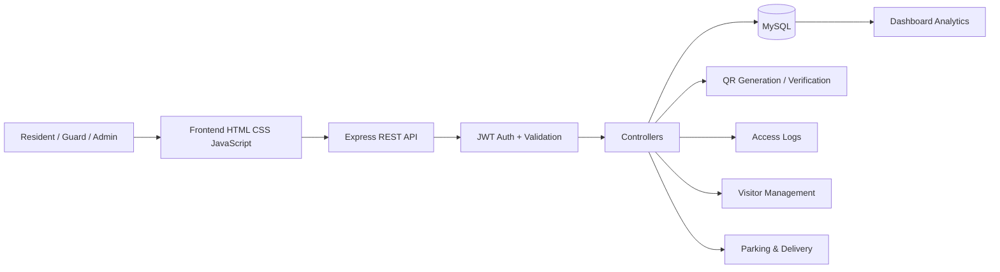
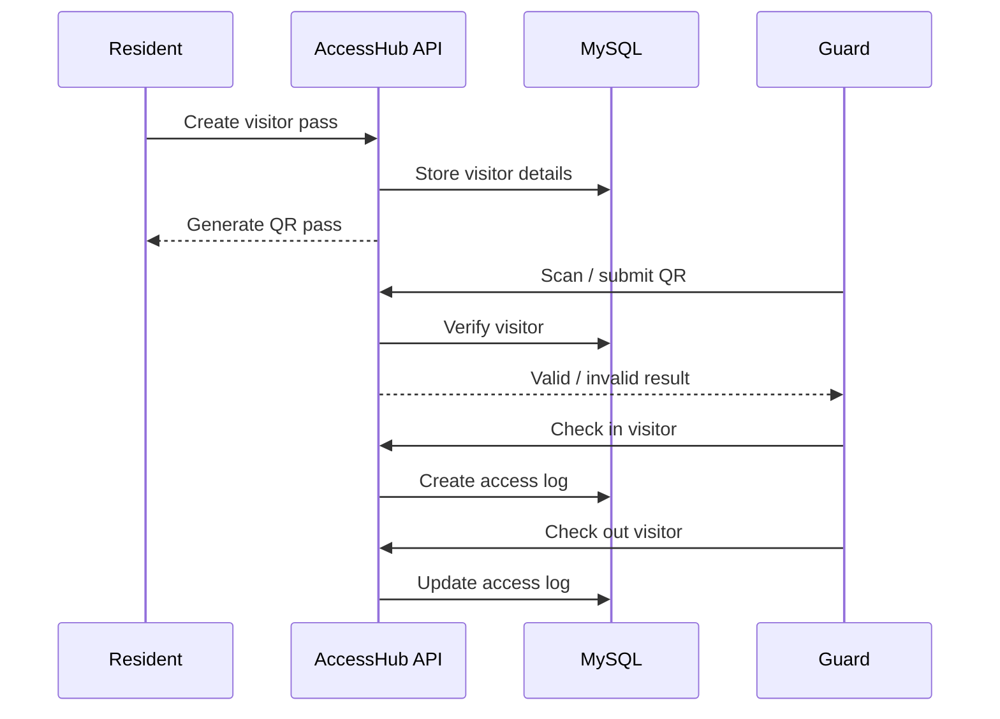

# AccessHub

AccessHub is a smart visitor and community access management platform for gated communities. It streamlines visitor registration, QR-based verification, security check-in/out, delivery tracking, parking management, and access analytics through a unified web application.

## Highlights

- Resident and security-guard authentication with JWT + bcrypt
- QR-based visitor passes and verification
- Visitor check-in and check-out logging
- Resident visitor management
- Delivery tracking
- Parking-slot management
- Dashboard summaries and access analytics
- MySQL relational database
- Express REST API with a vanilla HTML/CSS/JavaScript frontend
- Security middleware including Helmet, CORS, rate limiting, and parameterized SQL

## Architecture

```text
AccessHub/
├── backend/
│   ├── config/          # Database connection
│   ├── controllers/     # Business logic
│   ├── middleware/      # Authentication and request middleware
│   ├── routes/          # REST API endpoints
│   ├── utils/           # QR and validation helpers
│   └── server.js        # Express application entry point
├── database/
│   └── schema.sql       # MySQL schema and seed data
├── frontend/
│   ├── css/             # UI styles
│   ├── js/              # Browser-side application logic
│   └── *.html           # Application screens
└── tests/
    └── health.test.js   # API smoke test
```

### Request flow

```text
Browser
   ↓
HTML / CSS / JavaScript
   ↓
Express REST API
   ↓
Authentication / Controllers / Validation
   ↓
MySQL
```

## Tech Stack

**Frontend:** HTML, CSS, JavaScript  
**Backend:** Node.js, Express.js  
**Database:** MySQL  
**Authentication:** JWT, bcrypt  
**QR:** QRCode / QR scanner integration  
**Security:** Helmet, CORS, rate limiting, parameterized SQL

## Local setup

1. Install Node.js and MySQL.
2. Open the `backend` directory.
3. Run `npm install`.
4. Create `.env` from `.env.example`.
5. Create the `accesshub` database and import `database/schema.sql`.
6. Run `npm start`.
7. Open `http://localhost:5000`.

Do not commit `.env` or `node_modules`.


## System Architecture



## Visitor Workflow



## Core Modules

| Module | Responsibility |
|---|---|
| Authentication | Registration, login, JWT authorization |
| Visitor Management | Visitor passes, QR verification, entry/exit |
| Security Desk | Check-in/out and access logs |
| Delivery Management | Delivery records and status |
| Parking | Slot tracking and utilization |
| Dashboard | Operational summaries and analytics |
